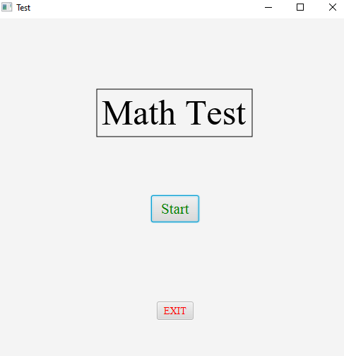

# MathTest
## Synopsis
This is a randomly generated math test the has addition, subtraction, multiplication, and division
## Motivation
While I was taking a test I thought it would be a fun project to make my own test.
## How to Run
Download MathTest src files and run them in a code editor

## Code Example
I like this code because it simplifies the process of getting the results

## Tests
using JUnit4 just go to GradeTest and click the run button
## Contributors

This code is Finished, however feel free to make desired improvements

contributors: Garron Haley

